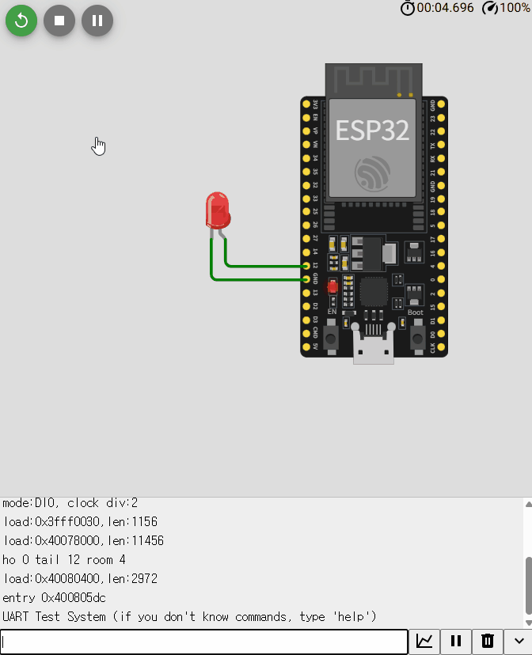

# 📑 03_PWM_Control_with_FSM

## 📌 要約
PWM理論の学習のため、Wokwiシミュレーションを用いてRUN状態のLEDをPWMで制御した。  
デューティ値はそれぞれ10%、50%、90%の3段階で制御できるようにした。

---

## 🚀 1. 背景と目的

組込み制御では、モーターやブザーなどの制御にPWM理論を応用し、  
デバイスの動作を制御することができる。

PWM制御に必要な主な要素は、周波数とデューティ比である。  
0と1で構成される周期的なスクエア波において、  
1/周期が周波数となり、デューティは1の状態が占める時間の割合を意味する。

本実習では以下を目的とした。

- 産業制御のイメージを出すため、前の例と同様にFSM構造を採用した。
- メニューボタンで変更できるデューティ比は10%、50%、90%の3段階とした。
- 状態はIDLEとRUNの2つのみとした。
- 産業制御の考え方として、IDLE状態ではメニューボタンを押しても動作せず、案内メッセージを出力するようにした。
- 解像度は8bit（256段階）とした。

---

## 🔍 2. 課題 (Challenge)

PWM理論の学習を目的としているため、  
モーターやブザーは使用せず、LEDを用いて動作確認を行った。

---

## 🛠 3. 解決策と実装

### ■ PWM設計
- 10%、50%、90%の3段階デューティ比によるPWM制御
- 解像度は8bit（256段階）

### ■ FSM構造

**State**
- IDLE
- RUN

**Event**
- START
- MENU BUTTON PRESS
- RESET

---

## 📊 4. 状態遷移表

| Current | Event   | Next  | 備考 |
|----------|---------|-------|------|
| IDLE     | START   | RUN   | IDLE表示LEDが消灯し、初期デューティ値からPWM制御開始 |
| IDLE     | MENU BUTTON PRESS | 変化なし | デューティ変更は行われず、案内メッセージのみ出力 |
| RUN      | MENU BUTTON PRESS | 変化なし | デューティ値が10→50→90の順で変更 |
| RUN      | RESET   | IDLE  | IDLE状態へ復帰 |

---

## ▶️ 5. 動作確認

- IDLE: IDLE LED ON / PWM LED OFF
- RUN: PWM LED ON / IDLE LED OFF
- RESETによりIDLEへ復帰

---

## 💡 6. 考察 (Insight)

1. PWM制御では周波数、デューティ比、解像度の設定が重要である。
2. モーター制御ではデューティ比、ブザー制御では周波数が重要なポイントとなる。
3. 実際のPWM制御では可聴周波数を考慮し、周波数を10kHz以上に設定することが望ましい。
4. PWMを応用できる他の用途についても今後調査していきたい。

