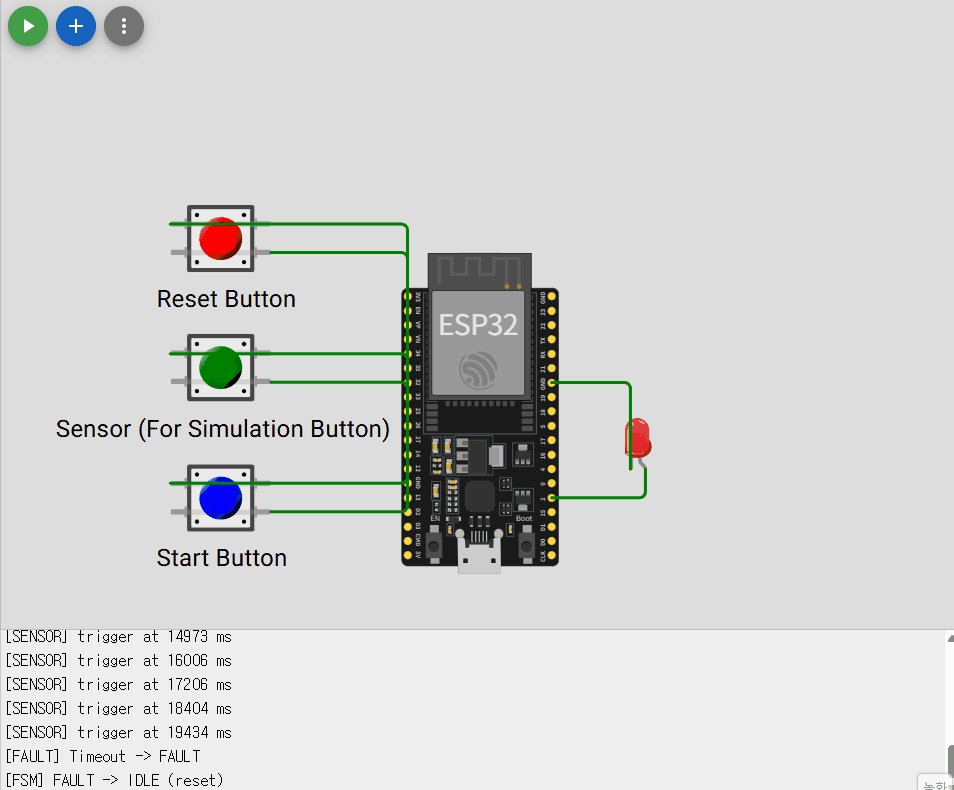

# 📑 02_Timer Interrupt & Timeout (Non-RTOS)

## 📌 要約
1msタイマー割込みを基準時間として利用し、  
FSM（Finite State Machine）構造に基づく制御ロジックを実装した。

RUN状態において一定時間（3秒）センサー入力が発生しない場合、  
FAULT状態へ遷移するTimeout検知機能を実装した。

---

## 🚀 1. 背景と目的

組込み制御では、一定時間内にイベントが発生しない場合に  
安全側へ制御を移行するTimeout設計が重要である。

本実習では以下を目的とした。

- タイマー割込みによる1ms基準時間の生成
- Δt（現在時刻 − 最終イベント時刻）方式によるTimeout判定
- 状態（IDLE / RUN / FAULT）に基づく制御設計
- ISR最小化設計の理解

---

## 🔍 2. 課題 (Challenge)

ポーリング方式のみで時間管理を行うと、  
処理負荷やループ周期の影響により正確な時間管理が難しくなる。

また、センサー入力が一定時間発生しない状況を  
安全に検出するためには、明確な時間基準が必要である。

---

## 🛠 3. 解決策と実装

### ■ タイマー割込み設計
- 1MHzタイマー生成（1tick = 1µs）
- 1000tickごとに割込み発生（1ms周期）
- ISR内では g_ms++ のみ実行（処理最小化）

### ■ FSM構造

**State**
- IDLE
- RUN
- FAULT

**Event**
- START
- SENSOR
- RESET
- TIMEOUT

### ■ Timeout判定ロジック

now - lastSensorMs > 3000

Δt方式を用いることで、  
タイマーオーバーフローが発生しても安全に時間計算が可能である。

---

## 📊 4. 状態遷移表

| Current | Event   | Next  | 備考 |
|----------|---------|-------|------|
| IDLE     | START   | RUN   | タイマー基準初期化 |
| RUN      | SENSOR  | RUN   | lastSensorMs更新 |
| RUN      | TIMEOUT | FAULT | 3秒以上入力なし |
| FAULT    | RESET   | IDLE  | 手動復帰 |

---

## ▶️ 5. 動作確認

- IDLE: LED低速点滅
- RUN: LED高速点滅
- 3秒間センサー入力なし → FAULT
- RESETによりIDLEへ復帰

---

## 💡 6. 考察 (Insight)

1. ISR内では処理を最小化することが重要である。
2. Δt方式は組込み設計における基本パターンである。
3. 状態遷移を明確に分離することで制御ロジックの可読性が向上した。
4. ポーリングと割込みの役割分離の重要性を理解した。
